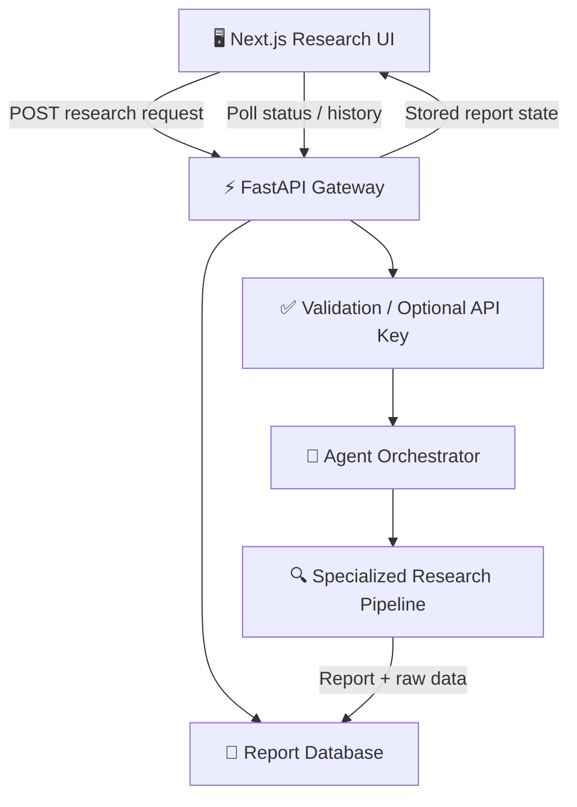

<div align="center">

# 🔎 DevScout AI

### Multi-Agent Developer Research Workspace, Background Intelligence Jobs & Persistent Report Dashboard

**DevScout AI** is a full-stack research workspace that turns a query into a background intelligence job and stores the resulting report for later retrieval. A Next.js 16 interface communicates with a FastAPI research API, which validates requests, dispatches specialized research through an agent orchestrator, and persists job state and generated reports in a local database.

<p align="center">
  
  
  
  
  
  
</p>

</div>

---

## 🏛️ System Architecture



> [!NOTE]
> Research execution is dispatched as a background task. The initial request returns a `job_id`, while status and report endpoints allow the frontend to retrieve progress and completed output without keeping the original request open.

## 🔬 Supported Research Types

The API currently recognizes:

`developer` · `startup` · `email` · `youtube` · `reddit` · `idea` · `social` · `linkedin` · `npm`

## 📡 API Workflow

| Method | Endpoint | Purpose |
|---|---|---|
| GET | `/api/v1/health` | Process liveness check |
| GET | `/api/v1/ready` | Database/required-queue readiness check |
| POST | `/api/v1/research` | Start a background research job |
| GET | `/api/v1/research/status/{job_id}` | Read job state and report output |
| GET | `/api/v1/history` | Return recent research jobs |
| GET | `/api/v1/research/report/{job_id}` | Retrieve a stored report |

An optional `API_SECRET_KEY` environment value adds `X-API-Key` protection to research creation. All workspace and report endpoints require a valid bearer token in production.

## 🚀 Local Development

### Web application

```bash
cd apps/web
npm install
npm run dev
```

The Next.js frontend runs on `http://localhost:3000` by default.

### API application

From `apps/api`, install the Python dependencies required by the API and agent modules, then launch FastAPI with Uvicorn:

```bash
cd apps/api
uvicorn main:app --reload
```

The API CORS configuration permits only the origins listed in `CORS_ORIGINS`.

## Production configuration

Use PostgreSQL and Redis/RQ as separate API and worker services. Start the API with `uvicorn main:app --host 0.0.0.0 --port 8000` and the worker with `python worker.py`. Apply Alembic migrations during deployment rather than relying on local SQLite compatibility migration behavior.

Required production settings:

- `APP_ENV=production`
- `DATABASE_URL=postgresql://...`
- `REDIS_URL=rediss://...` (or a private Redis network URL)
- `CORS_ORIGINS=https://your-frontend.example`
- `JWT_SECRET` with at least 32 random characters
- `ENABLE_DEMO_AUTH=false`, `ENABLE_DEV_TOKEN_AUTH=false`, `TRUST_IDENTITY_HEADERS=false`
- `REQUIRE_QUEUE=true`, `ALLOW_LOCAL_QUEUE_FALLBACK=false`, `LOG_JSON=true`
- `NEXT_PUBLIC_API_URL=https://your-api.example` in the frontend build

Production startup fails closed if authentication or CORS configuration is unsafe. `/api/v1/ready` returns HTTP 503 when the database or a required queue is unavailable.

## Verification

```bash
cd apps/api
pytest -q
ruff check .

cd ../web
npm run lint
npx tsc --noEmit
npm run build
npm audit

cd ../../packages/agent-reach
pytest -q
ruff check .
```

## 📁 Repository Architecture

```text
DevScout-AI/
├─ apps/
│  ├─ api/
│  │  ├─ agents/              # Research agent/orchestration modules
│  │  ├─ database.py          # Report persistence layer
│  │  ├─ devscout.db          # Local research/report database
│  │  └─ main.py              # FastAPI routes and background jobs
│  └─ web/
│     ├─ src/                 # Next.js application source
│     ├─ public/              # Static web assets
│     └─ package.json         # Next.js/React dependencies and scripts
├─ packages/                  # Shared monorepo packages
└─ README.md                  # Project documentation
```

## 👤 Project Author

Developed and maintained by **Shreeharsh Patil**.

- **Email:** shreeharsh.dev@gmail.com
- **GitHub:** [github.com/shreeharsh-patil](https://github.com/shreeharsh-patil)
